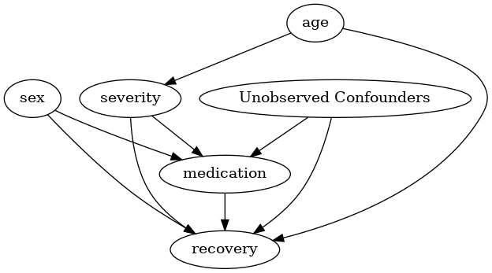
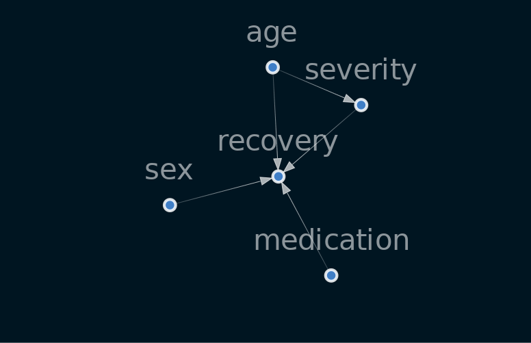
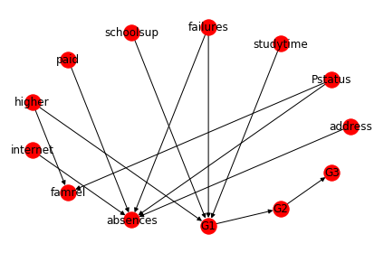

# My notes and examples on Causality

- The Book of Why: The New Science of Cause and Effect - Dana Mackenzie and Judea Pearl [[open notes]](./the-book-of-why/notes.md)

# Applications

## Causal Diagrams

[Causal Diagrams: draw your assumptions](./examples/causal_diagrams.ipynb)

## Causal Inference

[Causal Impact: state-space models in settings where a randomized experiment is unavailable](https://millengustavo.github.io/causalimpact/)

[Open code - Jupyter Notebook](https://github.com/millengustavo/trends-causal-impact/blob/master/causal-searches.ipynb)

## Causal Nex

[Open tutorial](./examples/first_causalnex_tutorial.ipynb)

