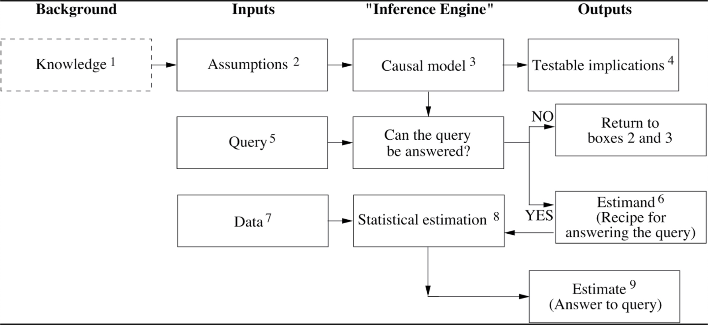

# The Book of Why: The New Science of Cause and Effect
Author: Dana Mackenzie and Judea Pearl

# Introduction: Mind over Data

Book mission:
1. to lay in nonmathematical language the intellectual content of the Causal Revolution and how it
is affecting our lives as well as our future;
1. to share some of the heroic journeys, both successful and failed, that scientists have embarked on when confronted by critical cause-effect questions.
2. to describe how robots can be constructed that learn to communicate in our mother tongue—the language of cause and effect

> "The human brain is the most advanced tool ever devised for managing causes and effects (...) Data is profoundly dumb. Data do not understand causes and effects; humans do."

Calculus of causation consists of two languages: 
- Causal diagrams, to express what we know
- A symbolic language (resembling algebra), to express what we want to know

The *do*-operator signifies that we are dealing with an intervention rather than a passive observation

"Algorithmization of counterfactuals"

## A Blueprint of Reality

We collect data only after:
- we posit the causal model
- we state the scientific query we wish to answer
- we derive the estimand

Information about the effects of actions or interventions is simply not available in raw data, unless it is collected by controlled experimental manipulation

> "If we ever want robots to answer 'Why?' questions or even understand what they mean, we must equip them with a causal model and teach them how to answer counterfactual queries"

# Ch1. The Ladder of Causation

The world is not made only of dry facts, these facts are glued together by cause-effect relationships. Causal explanations, not dry facts, make up the bulk of our knowledge, and should be the cornerstone of machine intelligence.

The connection between imagining and causal relations is almost self-evident. It is useless to ask for the causes of things unless you can imagine their consequences.

## The three levels of causation

Three distinct levels of cognitive ability: seeing, doing and imagining

1. **Association (seeing)**

One event is associated with another if observing one changes the likelihood of observing the other

2. **Intervention (doing)**

We cannot answer questions about interventions with passively collected data, no matter how big the data set or how deep the neural network

3. **Counterfactuals (imagining)**

“What if I had done…?” and “Why?” -> Both involve comparing the observed world to a counterfactual world. Experiments alone cannot answer such questions. 

While rung one deals with the seen world, and rung two deals with a brave new world that is seeable, rung three deals with a world that cannot be seen (because it contradicts what is seen). To bridge the gap, we need a model of the underlying causal process, sometimes called a “theory” or even (in cases where we are extraordinarily confident) a “law of nature.” In short, we need understanding.

## The mini-Turing test

Take a simple story, encode it on a machine, and then test to see if the machine can correctly answer causal questions that a human can answer

## Scheme for passing the mini-Turing test

- Translate the story into a diagram
- Listen to the query
- Perform a surgery that corresponds to the given query (intervetional or counterfactual; if the query is associational then no surgery is needed)
- Use the modified causal model to compute the answer

## On Probabilities and Causation

Probabilities lie on the first rung of the Ladder of Causation and cannot ever (by themselves) answer queries on the second or third rung. Any attempt to "define" causation in terms of seemingly simpler, first-rung concepts must fail

> While probabilities encode our beliefs about a static world, causality tells us whether and how probabilities change when the world changes, be it by intervention or by act of imagination

# Ch3. From evidence to causes: Reverend Bayes meets Mr. Holmes

A causal diagram is a Bayesian network in which every arrow signifies a direct causal relation, or at least the possibility of one, in the direction of that arrow. 

Not all Bayesian networks are causal, and in many applications it does not matter. However, if you ever want to ask a rung-two or rung-three query about your Bayesian network, you must draw it with scrupulous attention to causality

> The most important role of Bayes's rule in statistics: we can estimate the conditional probability directly in one direction and use mathematics to derive the conditional probability in the other direction.

In Bayesian networks, we tell the computer the forward probabilities, and the computer tells us the inverse probabilities when needed

Bayes's rule: a way to update our belief in a particular hypothesis. An empirical claim to faithfully represent the English expression "given that I know". Bayes's rule informs our reasoning in cases where ordinary intuition fails us or where emotion might lead us astray

## Scientific method

In many ways, Bayes’s rule is a distillation of the scientific method. 

The textbook description of the scientific method goes something like this: (1) formulate a hypothesis, (2) deduce a testable consequence of the hypothesis, (3) perform an experiment and collect evidence, and (4) update your belief in the hypothesis. 

Usually the textbooks deal with simple yes-or-no tests and updates; the evidence either confirms or refutes the hypothesis. All evidence comes with a certain amount of uncertainty. Bayes’s rule tells us how to perform step (4) in the real world.

## Bayesian Networks: what causes say about data

### A -> B -> C
Chain, or mediation

B = the mechanism, or mediator, that transmits the effect of A to C

### A <- B -> C
Fork

B = common cause or confounder of A and C

A confounder will make A and C statistically correlated even though there is no direct causal link between them

### A -> B <- C
Collider

E.g. Talent -> Celebrity <- Beauty

If A and C are independent and we condition on B, we will see a negative correlation between A and C  (Finding out that a celebrity is unattractive increases our belief that he or she is talented)

This negative correlation is sometimes called collider bias or the "explain-away" effect

**Chains, forks and colliders**: keyholes through the door that separates the first and second levels of the Ladder of Causation. Secrets of the causal process that generated the data we observe; in the form of conditional dependences and independences in the data

## Bayesian networks
Is nothing more than a compact representation of a huge probability table

The most interesting thing to do with Bayesian networks is to solve the inverse-probability problem

Whereas a Bayesian network can only tell us how likely one event is, given that we observed another (rung-one information), causal diagrams can answer interventional and counterfactual questions

> Statisticians consider it permissible to talk about causes and effects in one situation: a **randomized controlled trial (RCT)** in which a treatment A is randomly assigned to some individuals and not to others and the observed changes in B are then compared. Here, both orthodox statistics and causal inference agree on the meaning of the sentence “A causes B.”